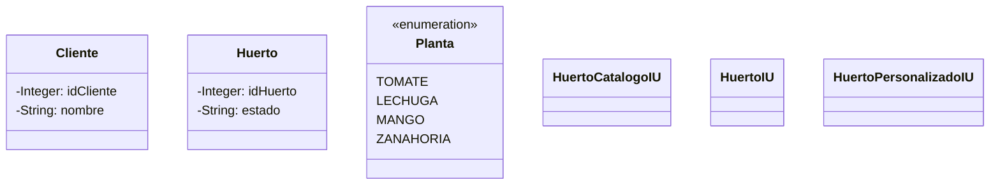

## Diagrama de clases: ##

```mermaid
classDiagram
class Cliente{
-Integer: idCliente
-String: nombre

    }
    class Huerto {
        -Integer: idHuerto
        -String: estado
    }
    class Planta{
    <<enumeration>>
    TOMATE
    LECHUGA
    MANGO
    ZANAHORIA
    }
    class HuertoCatalogoIU{
    
    }
    class HuertoIU{
    
    }
    class HuertoPersonalizadoIU{
    
    }
```   
      